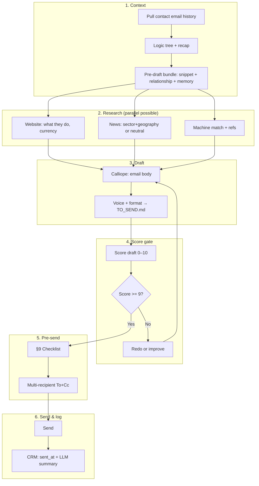

# Workflow: How we design outgoing marketing emails for leads

This workflow describes how Machinecraft designs and sends engagement/re-engagement emails to website and campaign leads. Use it for drip campaigns, 24_WebSite_Leads, and similar outbound.

**Audit (deeper, human, contextual, no hallucinations):** See **`data/knowledge/email_workflow_audit_deeper_human_contextual.md`** for the gaps-and-improvements table, verification gates, and recommended additions. The following are already integrated: pre-draft context bundle (§3.0), no invented headline (§3.1), inquiry date only when sourced (§3.2), "something new" = one real reference (§3.4), one question specific to lead (§3.6), "you said" only with snippet (§3.8), verification checklist (§9).

**Reference learning (sales agent):** The Eduardo / Forma 3D email is the **taught pattern** for warm, engagement-focused lead emails: website scrape → sector-relevant news + geopolitics → congratulate and ask questions (no “I saw on your site”) → quote block from PDFs (only machines we quoted) → MBB-style → plain text → reply in thread. See **`data/knowledge/lead_email_drafting_learnings_eduardo_case.md`** for the full learning set.

---

## 1. Goal

Produce a **single, send-ready email** that is:

- **Engagement-driving** — concrete, valuable, and likely to get a reply.
- **Personalised** — inquiry details, region-relevant references, and (where possible) a real news or company hook.
- **Polished** — Rushabh voice, mobile-friendly formatting (bullets, no pipe tables), one clear CTA.
- **Traceable** — sent from rushabh@machinecraft.org, logged in CRM after send.

### 1b. Vibe (tone we set)

**Sound human, warm, curious — not here to sell, here to chat about the industry.** Every lead email should feel like a person reaching out to talk shop: industry chat, curious questions, small talk, and genuine interest in their situation. We mention machines and specs in context of the conversation, not as a pitch. Default to “fellow industry person” not “salesperson”.

---

## 2. Inputs

- **Lead source:** e.g. `enriched_leads.json` (id, name, company, email, timestamp, industry, specs).
- **Knowledge:** sales_playbook, case_studies, customer_orders_history, Netherlands/EU reference sites.
- **Live data (when available):** Atlas (projects in production, e.g. NRC Russia), NewsData.io (news hook), optional website scrape (Iris / scrape_url).

### 2b. Lead heat / prioritisation

**Formula:** Heat = **Engagement (0–4)** + **Value (0–3)** + **Export (0–3)** → max 10. Hot = 7+, Warm = 4–6, Cold = 0–3. Full scoring rules and how to use: **`data/knowledge/lead_heat_formula.md`**. Contact context in `24_WebSite_Leads/*_contact_context.md` flags high-value / export-oriented leads where applicable.

---

## 2a. Workflow visualization — serial, parallel, and score gate

**Purpose:** See the full sequence at a glance, what can run in parallel, and how the **score gate** ensures we only send when the draft meets the bar (≥9/10).

### Serial steps (must happen in this order)

| Phase | Step | What |
|-------|------|------|
| **1. Context** | 1.1 | Pull contact email history → logic tree + recap (`pull_contact_email_history.py`). |
| | 1.2 | (Optional) Download quote PDFs → quote summary. |
| | 1.3 | Assemble pre-draft bundle: logic tree + one snippet from their last reply + check_relationship + recall_memory. |
| **2. Research** | 2.1 | Lead’s website (what they do, location, currency). |
| | 2.2 | News (NewsData.io / Iris) for sector+geography — or decide neutral opener. |
| | 2.3 | Machine match (sales_playbook: PF1-C vs PF1-X, size). Region refs (case_studies, Atlas). |
| **3. Draft** | 3.1 | Calliope: generate email body (ice breaker → inquiry recap → specs → budget/lead time → refs → questions → CTA → joke). |
| | 3.2 | Apply voice + format (Rushabh, final_format_style). Write TO_SEND.md. |
| **4. Score gate** | 4.1 | **Score draft** using the 10-point rubric (see `lead_email_workflow_scores.md`). |
| | 4.2 | **If score &lt; 8:** Redo draft (fix missing steps), then re-score. |
| | 4.3 | **If score 8–9:** Improve draft (add missing elements) until score ≥ 9. |
| | 4.4 | **If score ≥ 9:** Proceed to send path. |
| **5. Pre-send** | 5.1 | Run §9 checklist (verification, no hallucinations). |
| | 5.2 | Multi-recipient: `find_company_contacts.py` → To + Cc up to 3. |
| **6. Send & log** | 6.1 | Send via API or Gmail. |
| | 6.2 | CRM: contact, deal, interaction with **sent_at** + **LLM summary of email**. |
| | 6.3 | On reply: log interaction with **LLM summary of reply**. |

### What can run in parallel (within a phase)

- **Inside Research (phase 2):** Website scrape, news search, and machine/refs lookup can be done in parallel (e.g. 2.1 + 2.2 + 2.3 in parallel).
- **Inside Context (phase 1):** After 1.1, “recall_memory” and “check_relationship” can run in parallel with 1.2 (quote PDFs) if both are used.

### How to make sure “all is done” every time

1. **Pre-draft:** Use §3.0 + §3.0b (logic tree, pre-draft bundle, imports folder). Tick §8 full agentic table when assembling content.
2. **Draft:** Generate once; then **score** the draft with the 10-point rubric.
3. **Score gate:** If score &lt; 9 → redo the **skipped workflow steps** (see “Score first, then send” below), re-score; repeat until score ≥ 9. **Only when score ≥ 9** → allow send.
4. **Before send:** Run §9 checklist (including verification / no hallucinations).
5. **After send:** CRM log with sent_at + LLM summary. On reply, log reply with LLM summary.

### Score first, then send (mandatory)

**Order of operations:** Draft → **Score** → If score ≥ 9 → §9 checklist → Multi-recipient → Send. If score &lt; 9 → do **not** send; fix the draft and re-score.

1. **After drafting,** score the email using the 10-point rubric in **`lead_email_workflow_scores.md`** (manually or via `lead_email_workflow_loop.py` scoring).
2. **If score ≥ 9:** Check **price/lead time**: do we have a source (playbook, quote to this contact, Plutus)? If **no** → do **not** send; put in **waiting for info**, counter-ask Rushabh for indicative price/lead time for this spec, and send to lead only after we have it. If **yes** → run §9 checklist, multi-recipient, then send. Log CRM after send.
3. **If score &lt; 9:** Use the scorer’s **"missing"** list (or the rubric) to see which items were skipped. Redo those **workflow steps** in the draft:
   - **Contact history / logic tree** → Ensure draft references past touch/recap; re-run pull_contact_email_history if needed.
   - **Machine match** → Add what they asked + what we offer (PF1-C / PF1-X, size); India dual-option if relevant.
   - **Small talk + questions** → Add conversational opener and at least one specific question.
   - **Geopolitics / resin** → Add one short line (energy, resin, or India supply chain where relevant).
   - **Tooling / Industry 4.0** → Add one ask (tooling support or new kit / incentives).
   - **Latest builds / reference** → Add one named reference (case study, machine, region) from case_studies/Atlas.
   - **Reference past convos** → Add "when you got in touch…", "we'd quoted…", or "you'd said…" (only with snippet).
   - **Tech specs + prices, currency** → Add model, key specs, indicative price, lead time; currency by region (INR/EUR/GBP/USD).
   - **Case study + joke** → Add one case study match and one closing joke (industry/geopolitics).
   - **CTA + sign-off** → Add "web call anytime next week" and Rushabh sign-off.
   Then **re-score**. Repeat until score ≥ 9, then send.

### Score gate (before send)

```
Draft ready → Score (0–10) → Score < 9?  → Yes → Redo skipped workflow steps (see list above) → re-score
                         → Score ≥ 9?  → Yes → Run §9 checklist → Multi-recipient → Send → CRM log
```

Rubric: see **`data/imports/24_WebSite_Leads/lead_email_workflow_scores.md`** (10 points: contact history, machine match, small talk+questions, geopolitics, tooling/Industry 4.0, latest builds, past convos, specs+prices+currency, case study+joke, CTA+sign-off; optional +0.5 each for multi-recipient and CRM LLM summary).

**Run the full loop for the next N leads (draft → score → redo/improve until ≥ 9 → send):**
```bash
poetry run python scripts/lead_email_workflow_loop.py --next 5 --after 49 --dry-run   # draft + score only
poetry run python scripts/lead_email_workflow_loop.py --next 5 --after 49 --send       # actually send when score ≥ 9
```
Requires: Ira API running; OpenAI/Anthropic for scoring. See **`scripts/lead_email_workflow_loop.py`**.

**Blacklist:** Contacts we do not contact (time-wasters, requested do-not-contact) are listed in **`data/imports/24_WebSite_Leads/lead_blacklist.json`**. The workflow loop skips blacklisted lead IDs and emails when selecting the next leads. Add entries there (email, lead_id, name, company, reason, added_date) to stop outreach.

### Flow diagram (Mermaid)



---

## 3. Design steps (in order)

### 3.0 For any CRM/lead entry — always do this first (then draft)

**Before drafting any email to a contact, get full context from past conversations and keep it in memory. Then draft.**

1. **Pull all past conversations** from your mailbox (not just takeout or CRM):
   ```bash
   poetry run python scripts/pull_contact_email_history.py --email <contact_email> --output <path>.md --store-memory --summarize [--name "Contact Name"]
   ```
   Requires Ira API running (searches Gmail to/from this address). Use `--store-memory` to save condensed context in long-term memory. Use **--summarize** to have the LLM parse tech spec and proposal data and generate a **client-facing recap** — so when you email after a long time, you can remind them what they asked and what we offered (the recap is written into the output file).

2. **Review the interaction logic tree** (written into the output file):
   - **Timeline:** every interaction (date | Us/Them | subject | proposal? | their feedback snippet)
   - **Proposals we sent:** list with date and subject
   - **Their feedback:** what they said (interested, will get back, need approval, etc.)
   Use this to avoid repeating proposals/specs and to reference their last reply if relevant.

3. **Optional:** Run `check_lead_contact_history.py --email <email>` for CRM-only view (interactions logged in CRM). The pull script gives the full mailbox view and logic tree.

4. **Then draft** using the logic tree and (if stored) recalled memory: first-touch vs warm, what we already sent, what they said. Do not repeat info they already have.

**Pre-draft context bundle (for deeper, human, contextual drafts):** Before calling the draft API or Calliope, assemble: (1) logic tree + recap, (2) **one exact snippet from their last reply** (from the logic tree — for one genuine "you said" moment; only use if we have the snippet), (3) **check_relationship** output (warmth, interaction count) so tone/length can adapt, (4) **recall_memory** for this contact. Pass all into the draft context. See **email_workflow_audit_deeper_human_contextual.md** for full audit.

**Emailing after a long time:** If you ran the script with **--summarize**, the output file includes a **Recap summary (for email)** section — a short, client-facing paragraph (parsed by LLM from the threads) that reminds them what they asked for and what we offered. Use it in the draft so they have a clear picture without re-reading old threads.

### 3.0b Use the imports folder (24_WebSite_Leads) for context and examples

**Location:** `data/imports/24_WebSite_Leads/`. Use it so every draft is informed by this lead’s context and by past send-ready emails.

- **This lead’s files:** For the contact you’re drafting to, look for:
  - `*_contact_context.md`, `*_email_history.md` — contact summary and the output of `pull_contact_email_history.py` (logic tree, recap). Write the pull script output here (e.g. `eduardo_forma3d_email_history.md`) and pass it into the draft (e.g. `draft_lead_email_enriched.py --history-file`).
  - `*_TO_SEND.md` — current send-ready draft for this lead, if it exists. Use it as the working draft or to avoid duplicating content.
- **Learn from past sends:** Use **other** leads’ final/TO_SEND emails in the same folder as **tone and structure examples**: e.g. `email_lead2_ruslan_didenko_TO_SEND.md`, `email_vladimir_kilunin_FINAL_RUSHABH_VOICE.md`, `SEND_VLADIMIR_EMAIL.md`. They show Rushabh voice, section labels, bullets, budget/lead-time wording, and CTA style — reference them when drafting so new emails match.
- **Drip and lead data:** `ira-drip-campaign/data/enriched_leads.json` (lead id, company, industry, specs), `ira-drip-campaign/prompts/drip/` (email 1–4 prompts), and `ira-drip-campaign/.cursor/skills/drip-marketing.md`. Use for lead metadata and drip-stage wording when drafting drip steps.
- **Document-backed insights (optional):** For deeper personalisation, use hybrid search on `data/imports` (e.g. via `draft_lead_engagement_email.py` or Alexandros) for case studies and specs; or reuse phrasing and structure from the past TO_SEND examples above.

### 3.0c Quote data from PDFs (downloaded from emails)

When the contact’s threads contain **quote/proposal PDFs**, use them so the draft can cite exact prices and machine names.

1. **Download PDFs** from Gmail into a known folder (Alexandros can then reference it):
   ```bash
   poetry run python scripts/download_email_attachments.py --email <contact_email> --folder <folder_name> [--analyze] [--memory] [--to-send path/to/TO_SEND.md]
   ```
   - Saves PDFs under `data/imports/downloaded_from_emails/<folder_name>/` (e.g. `forma3d_eduardo/`).
   - **--analyze** runs PDF text extraction + LLM to pull quote data (ATF price, PF1 price, etc.) and writes `quote_summary.md` in that folder.
   - **--memory** stores a master memory (e.g. “Forma 3D latest quote: ATF at X, PF1 at Y; PDFs in downloaded_from_emails/forma3d_eduardo/”) so future drafts can recall it.
   - **--to-send** replaces the placeholder `<!-- INSERT_LATEST_QUOTE -->` in the TO_SEND file with a bullet list of the latest machines, prices, and specs so the email body shows them.
2. **Alexandros:** The folder is under `data/imports/`, so it is indexed with the rest of imports. Alexandros can search `downloaded_from_emails/<folder>/` and `quote_summary.md` when answering questions about that contact’s quote.
3. **Full pipeline:** Pull emails → download PDFs → extract → insert into TO_SEND. See `data/knowledge/data_pulling_from_email_past_conversations.md`. The email body uses `<!-- INSERT_LATEST_QUOTE -->`; the script replaces it with the extracted machines/specs/prices.

### 3.1 Ice breaker (news or company hook)

- **Check lead's website first** — understand **what they do** (sectors, products) and **where they're from** (country/region). Use this to personalise the opener and to **choose currency: if India, quote in INR** (e.g. ₹1.08 Crore EXW); if Europe/other, quote in EUR or USD as appropriate. *Learned from Vignesh (Lead 7):* Flexsol is India (Gurgaon) → quote in INR; website also confirmed telecom smart infrastructure (smart poles, enclosures). Never assume currency without checking location.
- **Be industry-specific.** News hook, references, and proof should match the lead's **segment** (e.g. sanitary → France sanitary/bathtub market; automotive → Turkey/EU refs; India telecom → PLI, optical fibre). Generic news is weaker than sector-specific news.
- Pick news **relevant to their sector and geography**. Add **geopolitics** (energy, raw materials) and ask if it affects them. Never say "I saw on your site".
- **Use NewsData.io** (NEWSDATA_API_KEY in .env) via Iris or `latest_news` / tools.
- Query: lead’s country + industry (e.g. “Turkey automotive”, “Turkish automotive”) or company name.
- Pick **one** recent headline or trend and open with it; then ask how they are (e.g. “Türkiye’s trade with Europe has been in the news lately — how are things on your side with [Company]?”).
- If no good news or no news search was run: use a neutral opener. **Never** invent a headline or trend (e.g. “I wanted to circle back on your inquiry”).

### 3.2 Remind them of their inquiry

- **When:** Only state a specific inquiry date or year if verified from a primary source (form logs, CRM). Do **not** trust enriched_leads.json timestamp alone — it can be wrong. If the only source is enriched_leads.json, do **not** state the date; use "when you got in touch about [X]" or "when you filled out our form" and omit the year.
- **What:** Short line that we’ve kept their requirements and are following up.
- **Tech specs:** List the specs they chose with **one-line description per module** (forming area, sheet loading, sheet size system, tool clamping, tool loading, heater, upper/lower table). Use **bullets only** (no Markdown pipe tables) for mobile readability.
- Format: `• **Label:** value — short description.`

### 3.3 Budget and lead time — offer the machine in the email

- **Offer the machine again with tech specs and revised price** in the email body when re-engaging. Include: model name, price (EXW), key specs (forming area, sheet thickness, loading, frames, tool clamping/loading, heater, tables), and lead time. Don’t rely on “happy to send the quote” alone — put the offer in the email so they can act without waiting for an attachment. *Learned from Zakaria (Lead 6):* PF1-C-2012 at 65k USD with full spec bullets.
- **India + PF1-X type spec — two options with comparison table:** When an **Indian client** asks for a **PF1-X type** machine (servo, etc.), offer **both** (1) **PF1-X** (servo, indicative INR) and (2) **PF1-C** (same forming size, pneumatic, indicative INR). Show them in a **comparison table** in the email (specs + prices side by side). Exception to "no pipe tables": use one clear table for this two-option comparison. See `lead_engagement_email_skill.md` and `lead_email_drafting_learnings_eduardo_case.md` Section 7.
- **Machine specs — verify from sales_playbook (or quote/Plutus).** **PF1-C max forming area = 2×3 m;** for bigger sizes we offer **PF1-X** (servo). **PF1-C = pneumatic table movements** (upper/lower table pneumatic). **PF1-X = servo;** on PF1-X, **universal frames and autoloader are optional.** Never state “electric servo” tables for PF1-C. *Correction:* Zakaria email wrongly said servo for PF1-C-2012; must be pneumatic. **PF1-C = cut-sheet manual feeding only**; roll feeder is on **PF1-R** and **ATF** only (0.2–1.5 mm sheet max). Do not offer "PF1-C with roll feeder". *Learned from Lead 7 (Vignesh).*
- **Inquiry status:** When re-engaging after a long gap, ask: Is this inquiry still active? Did you already purchase a machine elsewhere? We'd appreciate knowing so we can update our side and still help. *Learned from Lead 7 (Vignesh).*
- **Never invent price or lead time.** Use **only** figures from (1) **sales_playbook** table, (2) a **past quote to this contact**, or (3) **Plutus**. If you have no source, do **not** state a ballpark number; say instead: "Happy to send a formal quote once we lock the spec" or omit. *Correction 2026-03:* Big Bear and PRODI emails erroneously contained unsourced inflated figures; always verify source before stating any price or lead time.
- **Waiting for info (mandatory):** If we **do not** have price/lead time from playbook, quote, or Plutus for this lead’s machine/spec, **do not send** the email. Instead: (1) put the draft in **waiting-for-info** mode, (2) **counter-ask** Rushabh (e.g. draft an email to him or flag in the workflow: “Need indicative price and lead time for [machine/size] before send”), (3) once Rushabh (or playbook/quote/Plutus) provides the data, add it to the draft and **then** send. We can email Rushabh and he can reply with the figure; only after we have this data do we send to the lead.
- When you have a source: state clearly indicative price (e.g. from playbook or prior quote), lead time, and that a formal quote follows once spec is locked.

### 3.4 References (region-relevant)

- **EU references** for European/Turkish leads: Netherlands (Dezet, Dutch Tides), Sweden, UK, Belgium. Mention “where you can see machines” if applicable (e.g. near Den Haag).
- **Latest reference:** e.g. Dutch Tides PF1-X-6520 (largest in Europe) — one short paragraph. **"Something new about us"** must name **one** real reference (case study, machine, region) from **case_studies index or Atlas**. No generic "we've been busy in your segment" without a concrete example.
- **Production / showfloor:** Ask Atlas for current projects in production; mention 1–2 machines in a similar size class (e.g. NRC Russia, two machines). Do **not** present old installations as "latest" or "current production". Any phrase like "we just shipped" or "currently in production" must be backed by **Atlas** or a **dated** case study.

### 3.5 “We don’t have a customer in [country] yet”

- Cross-check **customer/installation list** (case_studies index, CRM, knowledge) by country.
- If we have no customer in the lead’s country: say so and that they could be the first. Keeps the email honest and creates a reason to reply.

### 3.6 Ask about their application

- **Questions:** What parts (dashboards, trim, covers)? Volumes? Current thermoforming or first line? In-house thermoforming today? **At least one question must be specific to this lead** (from their inquiry, industry, or website), not only generic.
- **Optional:** Scrape lead’s website (Iris / scrape_url) and ask 1–2 specific questions based on what they do. If scrape fails, use a generic line (e.g. “I had a look at [Company]’s focus on [industry]…”).

### 3.7 Single CTA

- Propose a **web call anytime next week** (e.g. "happy to do a 15–20 min call anytime next week — just say the day"). To go through application and quote.
- Ask for preferred slot and time zone; offer to send a calendar invite.

### 3.8 Voice and format

- **Rushabh voice:** Hi [First name], “I” not “we”, short paragraphs, no buzzwords (“reaching out”, “touching base”, “I hope this finds you well”). Sign-off: Best regards, Rushabh Doshi, Director — Machinecraft, rushabh@machinecraft.org, www.machinecraft.org.
- **Mobile-friendly:** Bullets for specs and lists; **no pipe tables** in the email body. See `prompts/email_rushabh_voice_brand.txt` and `data/knowledge/lead_engagement_email_skill.md`.
- **Final format and style:** Organised, data-driven, MBB-style. Structure: greeting → hook → context/recap (from past interactions) → key data block (scannable bullets) → CTA → sign-off. Use spacing and optional section labels (e.g. "WHERE WE LEFT OFF —") so the email is easy to scan. See `prompts/email_final_format_style.txt`.
- **Human, not bot:** Goal is they reply, not a full dossier. Engagement over completeness; one clear idea + one CTA. Don't put interaction tables or long recaps in the email — one line of context is enough for catch-ups. Sound like Rushabh talking to one person (contractions, mixed sentence length). When we have a **snippet from their last reply** (from logic tree), use it once — e.g. "You'd said you'd check with [X] — no rush." **Only** attribute "you said" / "you'd asked" if we have that snippet; otherwise use "when you got in touch about…" without quoting. See `prompts/email_rushabh_voice_brand.txt` "HUMAN, NOT BOT" section.

### 3.9 Multi-recipient (before send — always for outbound to a company)

**Before sending to any company:** find **up to 3 people** at that company so if one has left or the address bounces, others still get the email.

1. Run: `poetry run python scripts/find_company_contacts.py "Company Name"` (optional: `--domain company.com`). Uses Gmail search (Ira `/api/email/search`) and returns unique external addresses from from/to in matching threads.
2. Use **To:** first contact, **Cc:** second and third (if found).
3. In the draft: use "Hi [First name]," for a single primary, or **"Hi all,"** / **"Hi team,"** when sending to 2–3.
4. Send via `POST /api/email/send` with `to` = first email, `cc` = comma-separated others (or use a send script that calls `find_company_contacts` then sends).

See **data/imports/24_WebSite_Leads/lead_email_case_study_and_joke_guide.md** (Multi-recipient rule).

---

## 4. Outputs

- **Draft:** One markdown file (e.g. `email_lead2_ruslan_didenko_TO_SEND.md`) with Subject, body, and metadata (sources, news hook, Atlas note).
- **Send:** Via Ira API `POST /api/email/send` (user_initiated=True) from rushabh@machinecraft.org, or Gmail draft for human send.
- **CRM (after send):** Add entry: contact (create if new), deal (inquiry title, stage CONTACTED), **interaction** with channel=EMAIL, direction=OUTBOUND, subject, **sent_at** (when sent), and **LLM summary of what the email was about** (1–2 sentences) stored in interaction content/metadata.
- **CRM (when client replies):** Log the reply as an interaction (direction=INBOUND) with **LLM summary of the client’s reply** as metadata (e.g. in interaction content), so we have a searchable record of what they said.

---

## 4b. CRM logging — after send and on reply

**After every outbound lead email is sent:**

1. Create or update **contact** and **deal** in CRM (deal stage e.g. CONTACTED).
2. Create an **interaction** with:
   - channel=EMAIL, direction=OUTBOUND
   - subject = email subject
   - **sent_at** = when the email was sent (ISO8601 or in content JSON)
   - **content** = JSON or text including **LLM summary** of what the email was about (e.g. “Re-engagement: asked about their 2×3 m inquiry, offered PF1-C vs PF1-X options in INR, mentioned Dutch Tides reference, CTA web call next week”). Use a short LLM call (e.g. “Summarise in 1–2 sentences what this email is about”) on the email body if not already produced.

**When the client replies:**

1. Log the reply as an **interaction** with channel=EMAIL, direction=INBOUND, subject (reply subject).
2. Store in **content** (or metadata): classification/digest as today, **plus** an **LLM summary of the client’s reply** (e.g. “Client said they’re still interested, will check with management and revert by Friday”). So we have a searchable “what did they say” for every reply.

Implementation: CRM `create_interaction(..., content=...)` accepts Text; store JSON like `{"sent_at": "...", "summary": "..."}` for outbound and `{"reply_summary": "...", "classification": ...}` for inbound, or a single narrative string that includes the summary.

---

## 5. Tools and agents

| Step              | Tool / agent / data |
|-------------------|---------------------|
| **Pre-draft (always first)** | `pull_contact_email_history.py --email <email> --store-memory` (mailbox → logic tree → memory); then draft using tree + recall (see 5b, 5d) |
| **Imports (24_WebSite_Leads)** | This lead: `*_contact_context.md`, `*_email_history.md`, `*_TO_SEND.md`. Learn from: other leads’ `*_TO_SEND.md` / `*_FINAL*.md` (tone, structure). Drip: `ira-drip-campaign/` (enriched_leads.json, prompts/drip). See 3.0b. |
| **Memory recall** | `GET /api/memory/recall?query=contact <email>&user_id=<email>&limit=5` or use `draft_lead_email_enriched.py` |
| News hook         | NewsData.io (Iris, `latest_news`, NEWSDATA_API_KEY) |
| Inquiry + specs   | enriched_leads.json, sales_playbook |
| Budget / lead time | sales_playbook, Plutus (if quoted) |
| EU / refs         | case_studies (Dutch Tides, Dezet), sales_playbook |
| Production status | Atlas (get_project_status, ask Atlas) |
| Turkey / country check | case_studies/index.json, CRM list by region |
| Website scrape    | Iris scrape_url, web_search (optional) |
| Draft             | Calliope, lead_engagement_email_skill, email_rushabh_voice_brand |
| **Multi-recipient** | `find_company_contacts.py` (Gmail search via `/api/email/search`); To + Cc up to 3 |
| Send              | POST /api/email/send (IRA_EMAIL_MODE or user_initiated send) |
| **CRM log (after send)** | Contact, deal, interaction: subject, **sent_at**, **LLM summary of what email was about** (in content/metadata). Script or API. |
| **CRM log (on reply)** | Interaction: INBOUND, subject, **LLM summary of client’s reply** (in content/metadata). Email processor or sync. |

**When using only `POST /api/email/draft`, the following are not auto-injected:**
- **Memory recall** — Mem0 is not pre-fetched. Either pass "Recalled memories: …" in `context` (after calling `GET`/MCP `recall_memory` for the contact) or use a flow that injects it.
- **Relationship memory** — warmth, preferences, interaction count. Available to agents via `check_relationship`; not injected into the draft endpoint.
- **Episodic memory** — past interaction narratives. Pipeline injects this for chat; draft endpoint does not.
- **Clio / Hermes / Artemis** — KB search, drip context, lead intelligence. Used by Hermes' drip tools and by the draft_lead_engagement_email script (via Alexandros); not invoked by the simple draft API.
- **CRM** — deals, interactions. Not auto-attached to draft; include in context if relevant.

### 5b. Agents, memory, and APIs — what we use and what to add

**Used today (scripts + manual context):**
- **Gmail API** — via `pull_contact_email_history.py` (Ira `/api/email/search`, `/api/email/thread/<id>`). Full mailbox view and logic tree.
- **Mem0** — `--store-memory` in pull script stores condensed contact context. Calliope can **recall_memory** during ReAct if the prompt asks for it; otherwise memory is only used when you pass it in the draft context.
- **Calliope** — writes the final email (voice + format prompts). Used by `POST /api/email/draft` and by `draft_lead_engagement_email.py`.
- **Alexandros/imports** — `draft_lead_engagement_email.py` uses hybrid_search on data/imports for document-backed insights; not used when drafting only via API with plain context.

**Not auto-used when you call only `POST /api/email/draft`:**
- **Memory recall** — Mem0 is not pre-fetched. Either pass "Recalled memories: …" in `context` (after calling `GET`/MCP `recall_memory` for the contact) or use a flow that injects it.
- **Relationship memory** — warmth, preferences, interaction count. Available to agents via `check_relationship`; not injected into the draft endpoint.
- **Episodic memory** — past interaction narratives. Pipeline injects this for chat; draft endpoint does not.
- **Clio / Hermes / Artemis** — KB search, drip context, lead intelligence. Used by Hermes’ drip tools and by the draft_lead_engagement_email script (via Alexandros); not invoked by the simple draft API.
- **CRM** — deals, interactions. Not auto-attached to draft; include in context if relevant.

**Recommendation for a “complete” draft:** Before calling Calliope (or `POST /api/email/draft`), assemble context from: (1) `pull_contact_email_history.py` output (logic tree + recap), (2) **recall_memory** for the contact email, (3) optional **check_relationship** and CRM snippet. Pass that combined block in the draft request so the email is data-driven and personal. Optionally use a single script or “enriched draft” endpoint that does steps 1–3 and then drafts (see 5d).

**ReAct loop:** When you call `POST /api/email/draft` (or `draft_lead_email_enriched.py`), the request is handled by **Calliope**. Her `handle()` passes through to **`run()`** — the ReAct (Reason–Act–Observe) loop — because `draft_type` is `"email"` (no special-case skill). So the marketing email draft path **does use a ReAct loop**: Calliope can call tools (e.g. `recall_memory`, `search_emails`, `read_email_thread`, `search_knowledge`, `ask_clio`) during drafting. In practice, we usually **pre-fill** context (e.g. recalled memories + contact history in the request) so the model has everything in one message; the loop can still use tools if the prompt encourages it. The **document-backed** flow (`draft_lead_engagement_email.py`) does **not** use ReAct — it calls the LLM directly (`generate_text`) with a fixed system/user prompt and no agent loop.

### 5c. Making the email beautiful (plain text and optional HTML)

- **Plain text (current standard):** We use **no HTML** in the body for lead emails. Structure and “beauty” come from:
  - **prompts/email_final_format_style.txt** — section order, spacing (single/double line breaks), optional section labels (e.g. `WHERE WE LEFT OFF —`), bullets, one CTA, Rushabh sign-off.
  - Consistent typography: ~72-character line length, clear paragraph breaks, no pipe tables.
- **Sources and best practices (text-only):** See **data/knowledge/plain_text_email_sources.md** for curated links: Litmus (scannability, headers, whitespace, bullets, CTAs), Outbound Rocks (personalization, format, less-is-more), RFC line length (65–78 chars), and a plain-text structure example (GitHub Gist).
- **Optional HTML (future):** If we ever send rich HTML, use **MJML** (open source, [mjml.io](https://mjml.io), [GitHub mjmlio/mjml](https://github.com/mjmlio)) to build responsive templates; compile MJML → HTML and send that. Templates: e.g. [Mailteorite/mjml-email-templates](https://github.com/Mailteorite/mjml-email-templates). For now we stay plain-text for deliverability and simplicity.

### 5d. Enriched draft (one flow that pulls memory + context, then drafts)

To use **all** relevant agents and data when drafting (memory, relationship, contact history file, format prompts), use either:

1. **Manual assembly:** Run pull script → call `recall_memory` (MCP or internal) for the contact → optionally `check_relationship` and CRM → pass the combined text + `email_final_format_style` + `email_rushabh_voice_brand` in the draft context.
2. **Enriched draft script:** Run `scripts/draft_lead_email_enriched.py` with `--to`, optional `--history-file` (path to the pull script output MD), and optional `--name`. It calls `GET /api/memory/recall` for the contact, injects contact history, then `POST /api/email/draft` with instructions to apply `email_final_format_style.txt` and Rushabh voice. Example:
   ```bash
   poetry run python scripts/draft_lead_email_enriched.py --to pinto@forma3d.pt --history-file data/imports/24_WebSite_Leads/eduardo_forma3d_email_history.md --name "Eduardo Pinto" --out data/imports/24_WebSite_Leads/email_lead3_eduardo_pinto_TO_SEND.md
   ```

---

## 6. Reference implementations

- **Vladimir (lead 1):** `scripts/send_vladimir_email.py`, `scripts/add_vladimir_crm_entry.py`, `data/imports/24_WebSite_Leads/SEND_VLADIMIR_EMAIL.md`.
- **Ruslan (lead 2):** `data/imports/24_WebSite_Leads/email_lead2_ruslan_didenko_TO_SEND.md`, `scripts/add_lead2_ruslan_crm_entry.py`, NewsData.io ice breaker.
- **Skill:** `data/knowledge/lead_engagement_email_skill.md`.
- **Voice:** `prompts/email_rushabh_voice_brand.txt`.

---

## 7. Warm engagement checklist (optional — for warmer, less bot-like emails)

When you want the email to feel more human and engagement-driven (see Lead 10 — Yogesh/Metrolab):

- [ ] **Company web scrape:** Understand what they do (sector, products, geography) from their website; use to personalise opener and "something new" block; never say "I saw on your site".
- [ ] **Thermoforming intent match:** Tie their ask to a concrete use case (e.g. aerospace + Kydex = interior panels, trim) so the offer feels relevant.
- [ ] **News (sector + geography):** Pick one headline/trend (NewsData.io, Iris, or web search); open with it in 1–2 sentences.
- [ ] **Light geopolitics questions:** Add 1–2 short, conversational questions (e.g. how are energy costs or raw materials affecting your side? has that shifted timing for capacity?).
- [ ] **Something new about us:** One short block (e.g. recent reference, same size machine in another region, "we've been doing more in [their segment]") so they feel we're telling them something new — not a generic pitch.
- [ ] **Human style:** Short, varied sentences; one personal line (e.g. "I've been wondering how it's been on your side"); avoid repeated template phrases.

Reference: `email_lead10_yogesh_metrolab_TO_SEND.md`, `email_lead4_eric_vidal_TO_SEND.md`.

## 8. Full agentic mode workflow (default for every lead email)

Use this **full agentic workflow** for every lead email unless the user explicitly asks for a shortcut. Vibe: **human, warm, curious — here to chat about the industry, not to sell.**

| Step | Done? | What to do |
|------|-------|------------|
| **What machine did they ask?** | ✓ | From form/thread/CRM: forming area, depth, material, loading. Pull from `pull_contact_email_history` + logic tree. |
| **What machine should we offer?** | ✓ | Match to sales_playbook (PF1-C max 2×3 m; above that PF1-X). Same forming size or one clear option; India → PF1-C vs PF1-X dual-option table when relevant. |
| **Small talk + industry talk** | ✓ | Open with sector/region (e.g. how’s the industry there, how are things on your side). Not pitchy — conversational. |
| **Curious questions** | ✓ | Application (parts, volumes), first line?, in-house thermoforming?, how’s timing/capacity. One or two genuine questions. |
| **Geopolitics / raw material supply chain** | ✓ | Ask how energy costs or raw materials (resin, oil) are affecting them; has that shifted timing? Keep it short and human. |
| **Tooling support?** | ✓ | Ask if they’re looking for any tooling support (moulds, fixtures) alongside equipment. |
| **New equipment — energy efficient / Industry 4.0 / govt perks** | ✓ | Ask if they’re looking at new kit (energy efficient, Industry 4.0) to tap into any government incentives or perks. |
| **Our latest builds** | ✓ | One short block: recent reference, same size machine, or “we’ve been doing more in [their segment]”. Atlas for production; case_studies for references. |
| **India resin / oil situation** | ✓ | When relevant (India lead or global supply chain): mention situation in India re resin supply / oil crisis and ask if it’s on their radar. |
| **Reference past conversations or quotes** | ✓ | Use logic tree + recap: “when you got in touch about…”, “we’d quoted…”, “you’d said…”. No repeat of full proposal — one line of context. |
| **Tech specs + prices (from past)** | ✓ | Mention model name, key specs (forming area, depth, loading, table type), and **price from past quote or sales_playbook**. Currency by region (India → INR, EU → EUR, etc.). |
| **Currency by region** | ✓ | India → INR; Europe → EUR; Americas/other → USD or local. Check lead location before stating price. |
| **Funny last line (joke)** | ✓ | One closing joke — industry- or geopolitics-specific. Vary every time. See `lead_email_case_study_and_joke_guide.md`. |
| **CTA: web call next week** | ✓ | Invite a short web call anytime next week (e.g. “happy to do a 15–20 min call anytime next week — just say the day”). Rushabh sign-off. |

| **CRM after send** | ✓ | Add interaction: subject, **sent_at** (when sent), **LLM summary of what the email was about** (in content/metadata). Contact + deal as needed. See §4b. |
| **CRM on reply** | When client replies | Log reply as interaction (INBOUND) with **LLM summary of the client's reply** in content/metadata. See §4b. |

**Data to use:** `pull_contact_email_history.py` (logic tree, recap), past TO_SEND examples, sales_playbook, case_studies index, Atlas (latest builds), Plutus/past quotes for prices. **Multi-recipient** before send: `find_company_contacts.py` → To + Cc up to 3.

---

## 8b. Full workflow vs shortcut (what we actually run)

**Full workflow** (same as §8 above; Eduardo/Ruslan/Vladimir/Vignesh pattern) — use for high-value or first personalised touch:

| Step | Done? | What to do |
|------|-------|------------|
| **Past emails** | ✓ | `pull_contact_email_history.py --email <email> --output <path>.md --store-memory --summarize`; review logic tree + recap. |
| **Past quotes** | When threads have PDFs | `download_email_attachments.py --email <email> --folder <name> --analyze`; use quote_summary.md or insert in draft. |
| **Website scrape** | ✓ | Check lead site (Iris/scrape_url or manual): what they do, location, currency (India → INR). Never say "I saw on your site". |
| **News pickup** | ✓ | NewsData.io or Iris: one sector+geography headline; open with it; ask how they are. If none: neutral opener. |
| **Match machine + specs + price** | ✓ | sales_playbook; PF1-C vs PF1-X; indicative EXW + lead time; India dual-option table when PF1-X ask. |
| **Region references** | ✓ | EU/Turkey: Netherlands, Dutch Tides; "where you can see machines"; Atlas for production. |
| **Country check** | ✓ | "We don't have a customer in [country] yet" when true. |
| **Drive curiosity** | ✓ | Ask about application: parts, volumes, first line?, in-house thermoforming? Optional questions from scrape. |
| **Single CTA** | ✓ | Web call anytime next week or reply for quote; Rushabh sign-off. |
| **Voice pass** | ✓ | Rushabh voice; optional `rewrite_email_rushabh_voice.py`. |

**Shortcut** (leads 18–20 style: fast, short):

- ✓ Pull past emails + contact context + logic tree.
- ✓ Match inquiry → machine, specs, indicative price, lead time (currency by region).
- ✓ One line inquiry status; one CTA.
- ✗ No news hook, no scrape, no past-quote PDFs, no region refs, no "no customer in country", no application questions.

Use **full workflow** for maximum engagement; **shortcut** for volume or when you want a very short email.

**Default:** Run **full agentic mode workflow** (§8) unless the user explicitly asks for a short email or says "shortcut".

## 9. Checklist before send

- [ ] **Score gate:** Draft scored with 10-point rubric (see `lead_email_workflow_scores.md`). **Send only if score ≥ 9.** If score &lt; 9, redo the skipped workflow steps (see §2a "Score first, then send"), re-score until ≥ 9, then proceed.
- [ ] **Full context first:** `pull_contact_email_history.py --email <email> --store-memory` run; interaction logic tree reviewed; draft uses it (no repeat of proposals/specs already sent, references their feedback if relevant).
- [ ] **Imports folder used:** This lead’s `*_contact_context.md` / `*_email_history.md` in `data/imports/24_WebSite_Leads/` used in draft; past TO_SEND/FINAL examples referenced for tone and structure (see 3.0b).
- [ ] **Final format applied:** Structure and spacing per `prompts/email_final_format_style.txt` (organised, data-driven, section labels if needed, one CTA, Rushabh sign-off).
- [ ] **Multi-recipient:** `find_company_contacts.py "Company Name"` run; send to up to 3 (To + Cc); greeting "Hi all," / "Hi team," when multiple (see 3.9).
- [ ] Subject line clear and under ~60 chars if possible.
- [ ] Ice breaker uses a real news/company hook (or neutral opener).
- [ ] Inquiry date and specs correct; specs in bullets, no tables.
- [ ] Budget and lead time from authoritative source.
- [ ] References and “no customer in [country]” fact-checked.
- [ ] Production mention (e.g. NRC Russia) confirmed with Atlas if needed.
- [ ] One CTA (web call anytime next week); Rushabh sign-off and signature.
- [ ] **After send:** CRM updated — contact, deal, interaction with subject, **sent_at**, and **LLM summary of what the email was about** (see §4b).
- [ ] **When client replies:** Reply logged in CRM with **LLM summary of the reply** as metadata (see §4b).
- [ ] **Verification (no hallucinations):** Every **price/lead time** has a source (playbook, quote, Plutus); if not, **remove the number** or replace with "Happy to send a formal quote once we lock the spec"—**never invent a ballpark**. If the draft would be stronger with an indicative price but we have no source: **do not send**; put in **waiting for info**, ask Rushabh for the figure, then send once we have it. Every **reference** (customer, "latest", "current production") traceable to Atlas or case_studies. Every **"you said"** traceable to logic tree/thread; otherwise rephrased. Any **news hook** from a real search result; if none, neutral opener only. See **email_workflow_audit_deeper_human_contextual.md**.
