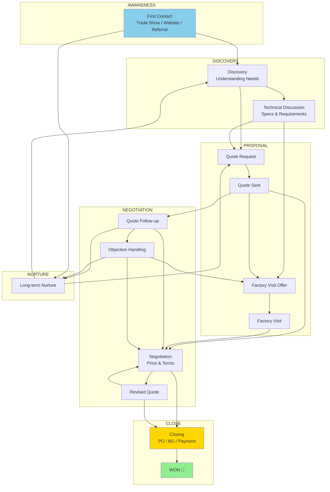

# European Sales Flow Diagram

Based on analysis of 5 successful deals.

## Stage Transition Frequency

| From | To | Count |
|------|-----|-------|
| technical | discovery | 12 |
| quote_request | technical | 11 |
| technical | quote_request | 9 |
| discovery | technical | 9 |
| objection_handling | technical | 9 |
| technical | factory_visit_offer | 7 |
| factory_visit_offer | closing | 6 |
| quote_request | first_contact | 6 |
| quote_followup | technical | 6 |
| technical | first_contact | 6 |
| discovery | quote_request | 6 |
| technical | quote_followup | 6 |
| first_contact | technical | 5 |
| quote_request | discovery | 5 |
| first_contact | quote_request | 5 |
| discovery | negotiation | 5 |
| first_contact | discovery | 4 |
| first_contact | factory_visit_offer | 4 |
| factory_visit_offer | quote_request | 4 |
| factory_visit_offer | technical | 4 |
| quote_request | factory_visit_offer | 4 |
| technical | negotiation | 4 |
| negotiation | factory_visit_offer | 4 |
| technical | objection_handling | 4 |
| negotiation | technical | 4 |
| discovery | factory_visit_offer | 3 |
| factory_visit_offer | first_contact | 3 |
| closing | quote_request | 3 |
| quote_request | quote_followup | 3 |
| factory_visit_offer | discovery | 3 |
| negotiation | objection_handling | 3 |
| closing | factory_visit_offer | 2 |
| factory_visit_offer | negotiation | 2 |
| technical | nurture | 2 |
| objection_handling | quote_request | 2 |
| first_contact | quote_followup | 2 |
| quote_followup | quote_request | 2 |
| quote_request | objection_handling | 2 |
| negotiation | discovery | 2 |
| negotiation | first_contact | 2 |
| negotiation | revised_quote | 1 |
| revised_quote | factory_visit_offer | 1 |
| factory_visit_offer | post_visit_followup | 1 |
| post_visit_followup | factory_visit_offer | 1 |
| closing | first_contact | 1 |
| discovery | closing | 1 |
| factory_visit_offer | nurture | 1 |
| nurture | first_contact | 1 |
| closing | technical | 1 |
| closing | negotiation | 1 |
| nurture | factory_visit_confirmed | 1 |
| factory_visit_confirmed | negotiation | 1 |
| quote_followup | factory_visit_offer | 1 |
| closing | quote_followup | 1 |
| quote_followup | objection_handling | 1 |
| objection_handling | first_contact | 1 |
| discovery | objection_handling | 1 |
| technical | won | 1 |
| won | nurture | 1 |
| nurture | negotiation | 1 |
| quote_followup | negotiation | 1 |
| factory_visit_offer | factory_visit_confirmed | 1 |
| factory_visit_confirmed | technical | 1 |
| technical | post_visit_followup | 1 |
| post_visit_followup | closing | 1 |
| factory_visit_offer | quote_followup | 1 |
| first_contact | objection_handling | 1 |
| objection_handling | quote_followup | 1 |
| quote_followup | first_contact | 1 |
| first_contact | closing | 1 |
| closing | objection_handling | 1 |
| nurture | technical | 1 |
| quote_request | negotiation | 1 |
| negotiation | quote_request | 1 |
| first_contact | negotiation | 1 |
| negotiation | post_visit_followup | 1 |
| post_visit_followup | first_contact | 1 |
| quote_request | won | 1 |
| won | closing | 1 |
| objection_handling | negotiation | 1 |
| negotiation | quote_followup | 1 |
| quote_followup | discovery | 1 |
| discovery | quote_followup | 1 |
| discovery | first_contact | 1 |
