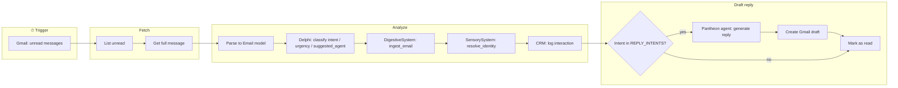
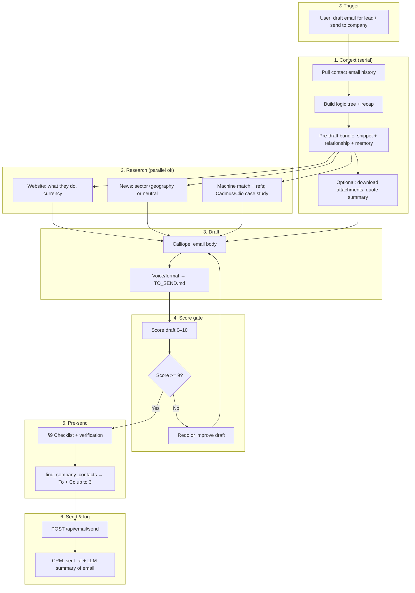

# Email workflow — n8n-style view and agent map

This doc shows the **complete email workflows** (inbound and outbound) in an n8n-style node flow, and **which agents are used when**.

---

## 1. Inbound email (inbox processing)

Trigger: unread emails in Gmail. Flow runs in **EmailProcessor** when OPERATIONAL mode processes inbox (or TRAINING mode observes).

| Node / step | What runs | Agent / system |
|-------------|-----------|----------------|
| List unread / Get full message | Gmail API | **EmailProcessor** (no agent) |
| Parse | `_parse_message()` | EmailProcessor |
| **Classify** | Intent, urgency, suggested_agent | **Delphi** |
| Digest | Entities, quotes, dates | **DigestiveSystem** (body system) |
| Resolve identity | Contact from CRM / cache | **SensorySystem** (body system) |
| Log interaction | CRM contact + interaction | **CRM** (EmailProcessor writes) |
| Generate reply | Draft reply body | **Pantheon agent** from classification (often **Calliope**, or Athena) |
| Create draft / Mark read | Gmail API | EmailProcessor |

**Agents used in inbound:** **Delphi** (classification), **Calliope** or other Pantheon agent (reply draft). Body systems: Digestive, Sensory.

---

## 2. Outbound lead email (full workflow)

Trigger: human or script starts “draft and send to lead”. Steps follow **outgoing_marketing_email_workflow.md** (§2a serial/parallel + score gate) and **lead_email_case_study_and_joke_guide.md**. **Serial:** Context → Research → Draft → Score gate → Pre-send → Send & log. **Parallel:** Within Research, website / news / machine+refs can run in parallel. **Score gate:** Score draft 0–10; if &lt; 8 redo, if 8–9 improve until ≥ 9; only if ≥ 9 allow send.

(When the client replies, log that reply in CRM with **LLM summary of the reply** as metadata — see inbound flow and §4b in outgoing_marketing_email_workflow.)

| Node / step | What runs | Agent / system |
|-------------|-----------|----------------|
| Pull contact email history | `pull_contact_email_history.py` | **Gmail API** (EmailProcessor.search_emails, get_thread); no agent |
| Build logic tree / recap | Script + optional LLM | Script; optional **Calliope** or generic LLM for recap |
| Download attachments / quote summary | `download_email_attachments.py` | Script + Document AI / LLM (no pantheon agent) |
| recall_memory / check_relationship | MCP or API | **Mnemosyne** (memory), **RelationshipMemory** (body system) |
| Case study by industry+size | KB / case_studies index | **Cadmus** (case studies), **Clio** (KB search) or Alexandros (imports) |
| News hook / scrape | Iris, web search | **Iris** (external intel) |
| Production / refs | Atlas, CRM | **Atlas** (projects), **Plutus** (pricing when needed) |
| **Generate email body** | Draft with voice + format | **Calliope** |
| **Multi-recipient** | find_company_contacts.py → Gmail search | **Gmail API** (search); no agent |
| Send | POST /api/email/send | **EmailProcessor.send_message** (no agent) |
| **CRM log (after send)** | Contact, deal, interaction: subject, **sent_at**, **LLM summary of what email was about** (in content/metadata) | **CRM**; script or API; LLM for summary |
| **CRM log (on reply)** | Interaction INBOUND + **LLM summary of client's reply** in content/metadata | **EmailProcessor** (inbound) or sync; LLM for reply summary |

**Agents used in outbound:** **Calliope** (draft), **Cadmus** (case study pick), **Clio** / **Alexandros** (docs/KB), **Mnemosyne** (recall), **Iris** (news/scrape), **Atlas** (production refs), **Plutus** (pricing when in context). **Multi-recipient** is a script + Gmail search (no agent).

---

## 3. Agent summary — when each is used

| Agent | Inbound (inbox) | Outbound (lead email) |
|-------|-----------------|------------------------|
| **Delphi** | ✓ Classify incoming email (intent, urgency, suggested_agent) | — |
| **Calliope** | ✓ Draft reply (when intent = reply) | ✓ Draft full email body (voice, format) |
| **DigestiveSystem** | ✓ Ingest email (digest content) | — |
| **SensorySystem** | ✓ Resolve sender identity | — |
| **Mnemosyne** | — | ✓ recall_memory for contact context |
| **Cadmus** | — | ✓ Case study choice by industry/size |
| **Clio** | — | ✓ KB search for refs, playbook, case studies |
| **Alexandros** | — | ✓ Document/imports search (when used) |
| **Iris** | — | ✓ News hook, website scrape |
| **Atlas** | — | ✓ Production status, project refs |
| **Plutus** | — | ✓ Pricing / quote data when in context |
| **Hermes** | — | ✓ Drip/campaign design; can invoke Calliope + Clio |
| **EmailProcessor** | ✓ Fetch, parse, search, create draft, send | ✓ search_emails (Gmail), send_message |
| **find_company_contacts** | — | ✓ Script: Gmail search → up to 3 contacts (To + Cc) |

---

## 4. Where the multi-recipient step lives

- **Workflow doc:** `data/knowledge/outgoing_marketing_email_workflow.md` — **§ 3.9** and **§ 9** (checklist).
- **Lead guide:** `data/imports/24_WebSite_Leads/lead_email_case_study_and_joke_guide.md` — **Multi-recipient rule** at top.
- **Script:** `scripts/find_company_contacts.py` (search by company name; returns up to 3 emails).
- **Send:** `POST /api/email/send` with `to` + `cc`; or lead send scripts (e.g. `send_lead50_big_bear_email.py`) that call the script then send.

No pantheon agent is used for multi-recipient; it’s Gmail search + script logic.
