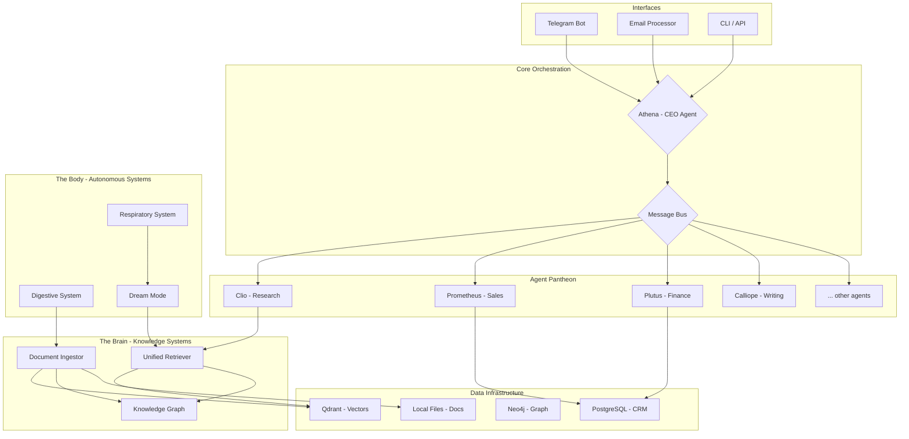

# Ira v3: System Architecture

**Author:** Manus AI
**Date:** 2026-03-06

## 1. Guiding Philosophy

The architecture of Ira v3 is founded on three core principles:

1.  **Full Vision, No Shortcuts:** Every architectural concept from the original dream—from the agent pantheon to the biological systems—is implemented, but with robust, modern engineering practices.
2.  **Modular & Decoupled:** Each component (agent, system, tool) is an independent, testable unit. This allows for parallel development, easier maintenance, and the ability to upgrade or replace individual parts without rewriting the entire system.
3.  **Controlled Autonomy:** The system is designed for proactive, autonomous operation (e.g., Dream Mode, Drip Engine), but within a framework of clear rules, explicit delegation, and comprehensive logging. We build a powerful team, not an uncontrollable entity.

This document details the technical architecture that brings this philosophy to life.

## 2. High-Level System Diagram

A high-level overview of the entire Ira ecosystem, from data ingestion to user interaction.

## 3. Core Components

The system is divided into four primary domains: The Pantheon, The Brain, The Body, and The Business.

### 3.1. The Pantheon: Multi-Agent Architecture

The Pantheon is the collaborative core of Ira, structured as a hierarchical multi-agent system. It mirrors a corporate org chart, with a CEO agent (Athena) delegating tasks to a suite of specialist C-suite and functional agents.

**Key Patterns:**

*   **Hierarchical Delegation:** Athena acts as the central router. She does not perform tasks herself but instead uses an `agents-as-tools` pattern. Her primary function is to analyze an incoming query and delegate it to the appropriate specialist agent (e.g., a sales query goes to Prometheus, a research query to Clio).
*   **Asynchronous Communication:** Agents communicate via a lightweight, in-process `MessageBus`. This is an async pub/sub system where agents can `publish` requests to topics (e.g., `topic='research'`) and `subscribe` to topics relevant to their function. This decouples agents from one another.
*   **Standardized Agent Interface:** All agents inherit from a `BaseAgent` class. This enforces a consistent interface (`async def execute(self, query: str, context: dict)`) and structure, making it simple to add new agents. Each agent is defined by its:
    *   `name`: A unique identifier (e.g., "clio").
    *   `role`: A detailed system prompt explaining its purpose, personality, and capabilities.
    *   `tools`: A list of functions the agent can call to perform its duties.

**Data Flow: A Sample Query**

1.  A user asks via Telegram: "What was our win rate for the PF1-C in Germany last quarter?"
2.  The `TelegramBot` interface passes the query to `Athena`.
3.  `Athena`'s LLM brain, guided by her system prompt, recognizes this as a sales/pipeline question. She chooses her `delegate_task` tool.
4.  `Athena` calls `delegate_task(agent_name='tyche', query='Calculate win rate for PF1-C in Germany for Q1 2026')`.
5.  The `MessageBus` routes this request to the `Tyche` (Pipeline Forecaster) agent.
6.  `Tyche` executes the query. Her tools allow her to connect to the CRM database (`ira_crm.db` and `quotes.db`), filter the data, perform the calculation, and generate a summary.
7.  `Tyche` publishes her result back to a response topic on the `MessageBus`.
8.  `Athena` receives the result, and if necessary, passes it to `Calliope` (Writer) to be formatted into a polished, user-facing response.
9.  `Athena` returns the final answer to the `TelegramBot`, which delivers it to the user.

### 3.2. The Brain: RAG and Knowledge Systems

The Brain is responsible for all knowledge storage, retrieval, and synthesis. It is a sophisticated, multi-layered system designed to provide agents with the most relevant and accurate context possible.

**Key Components:**

*   **Document Ingestion Pipeline (`DigestiveSystem`):** This is the entry point for all unstructured data. It reads files from the `data/imports` directory, uses the `Email Nutrient Extractor` logic to identify high-value "protein" content, chunks the text into meaningful segments (e.g., 256 tokens with 64-token overlap), generates embeddings using **Voyage AI**, and upserts the resulting `KnowledgeItem` vectors into **Qdrant**.

*   **Qdrant Vector Store:** This is the primary store for all chunked and embedded knowledge. We will maintain separate collections for different data types (e.g., `document_chunks`, `email_chunks`) to allow for targeted retrieval.

*   **Unified Retriever (Hybrid Search):** This is the core of the RAG system. When an agent needs information, it queries the `UnifiedRetriever`. The retriever performs a two-stage search:
    1.  **Retrieval:** It executes a hybrid search query against Qdrant, combining dense vector search (for semantic meaning) with sparse vector search (BM25 for keyword relevance). This ensures both conceptually similar and keyword-matching results are found.
    2.  **Reranking:** The initial set of results is then passed to a lightweight reranker like **FlashRank**. The reranker uses a more powerful cross-encoder model to re-score the top N results for their specific relevance to the original query, pushing the most salient information to the top.

*   **Neo4j Knowledge Graph:** While Qdrant stores the raw text, the Knowledge Graph stores the relationships *between* entities. During ingestion, we extract entities (Companies, People, Machines, Products) and their relationships (e.g., `(Company)-[:MANUFACTURES]->(Product)`, `(Person)-[:WORKS_FOR]->(Company)`). This allows for complex, multi-hop queries that a vector search cannot answer, such as "Find all customers in Germany who have been quoted for a machine that uses the same component as the PF1-C."

*   **Meta-Cognition Layer:** Before a final answer is generated, the `Metacognition` system assesses the retrieved context. It determines the `KnowledgeState` (e.g., `KNOW_VERIFIED`, `CONFLICTING`, `UNKNOWN`) and `SourceType` for the information. This allows Ira to express calibrated confidence in her answers, stating, for example, "I am highly confident based on the machine manual..." or "I have conflicting information from two different emails..."

### 3.3. The Body: Autonomous Systems

The Body provides the rhythm and self-improvement mechanisms that allow Ira to operate proactively and autonomously, evolving from a simple tool into a true agent.

*   **Respiratory System (Cadence):** This is the system's pacemaker. Implemented as a set of `asyncio` background tasks, it establishes the operational tempo:
    *   **Heartbeat:** A simple cron-like job that runs every 5 minutes to log that the system is alive, providing a basic health check.
    *   **Inhale Cycle:** A nightly or morning task that triggers the `DigestiveSystem` to ingest any new documents or data that have arrived in the past 24 hours.
    *   **Exhale Cycle:** An evening task that triggers **Dream Mode**, initiating the memory consolidation and learning process.

*   **Dream Mode (Learning):** This is the core of Ira's autonomous learning. Triggered by the Respiratory System, the `DreamMode` module performs several critical functions:
    1.  **Memory Consolidation:** It reviews recent memories and conversation logs, applying a spaced repetition algorithm (Ebbinghaus forgetting curve) to strengthen important memories and allow irrelevant ones to decay.
    2.  **Knowledge Gap Detection:** It analyzes queries that resulted in low-confidence answers or `UNKNOWN` knowledge states. These are flagged as "learning priorities."
    3.  **Creative Synthesis:** It takes these learning priorities and disparate pieces of information from the knowledge base and uses an LLM to find novel connections, generate hypotheses, and formulate new insights—mimicking the creative, problem-solving aspect of REM sleep.
    4.  **Campaign Reflection:** It analyzes the performance of recent drip marketing campaigns, correlating email content with reply rates to generate strategies for improvement.

*   **Immune System (Self-Healing):** This system is responsible for health, stability, and error recovery. It consists of:
    *   **Global Exception Handling:** A middleware layer in the FastAPI server that catches all unhandled exceptions, logs them with full context using the `ImmuneSystem`, and provides a graceful error response.
    *   **Startup Validation:** A procedure that runs when the server starts, checking connections to all external services (Qdrant, Neo4j, PostgreSQL, Voyage AI) and ensuring they are healthy before the agent begins processing requests.

### 3.4. The Business: CRM & Sales Automation

This domain contains the practical, business-oriented functionality that drives value for Machinecraft.

*   **CRM Database (PostgreSQL):** A robust, relational database managed with **SQLAlchemy** and **Alembic** for migrations. It serves as the single source of truth for all business data, with a clear schema:
    *   `contacts`: All individuals Ira interacts with.
    *   `companies`: The organizations contacts belong to.
    *   `deals`: Opportunities with stages, values, and expected close dates.
    *   `interactions`: A log of every single touchpoint (email sent, Telegram message received, meeting held), linked to contacts and deals.

*   **Autonomous Drip Engine:** This system, run as a scheduled background task, operationalizes sales outreach:
    1.  **Lead Selection:** It queries the CRM for leads that are due for a follow-up based on predefined campaign logic (e.g., "new leads in Europe who haven't been contacted in 7 days").
    2.  **Context Enrichment:** For each lead, it calls the `LeadIntelligence` module to gather real-time context (recent company news, industry trends).
    3.  **Personalized Drafting:** It passes the lead's history and the enriched context to the **Hermes (Marketing)** agent to draft a highly personalized email.
    4.  **Sending & Tracking:** It sends the email via the Gmail API and updates the lead's interaction log in the CRM.

*   **Email Processor:** This is the bridge between the outside world and Ira's brain. It continuously polls the `ira@machinecraft.org` inbox:
    1.  **Fetching:** It uses the Gmail API to fetch new, unread emails.
    2.  **Classification:** It passes the email content to the **Delphi** agent to classify intent (e.g., New Lead, Customer Question, Follow-up, Spam).
    3.  **Routing:** Based on the classification, it creates a task and routes it to **Athena** for handling, ensuring every inbound email gets a timely and intelligent response.
